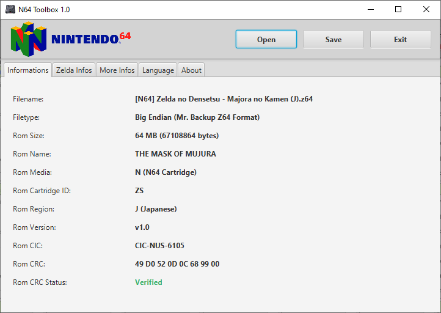

# N64 Toolbox
A user-friendly Java application to display basic informations about N64 Roms.

## Prerequisites ##
List of all required dependencies to build this software:
* [NetBeans IDE 8.2](https://netbeans.org/downloads/8.2/) - Java Integrated Development Environment
* [Java JDK 8](https://www.oracle.com/technetwork/java/javase/downloads/jdk8-downloads-2133151.html) - Java Devlopment Kit

## How to build ##
To successfully build this project:
* First open the project folder in Netbeans IDE 8.2.
* Then, right-click on the project in the *Projects* window to display the context menu.
* Select *Clean and Build* and wait until the console output a **BUILD SUCCESSFUL** message.
* The compiled application can be found inside the *dist* folder.

If something went wrong during this process, you can still submit a new issue to the project.
